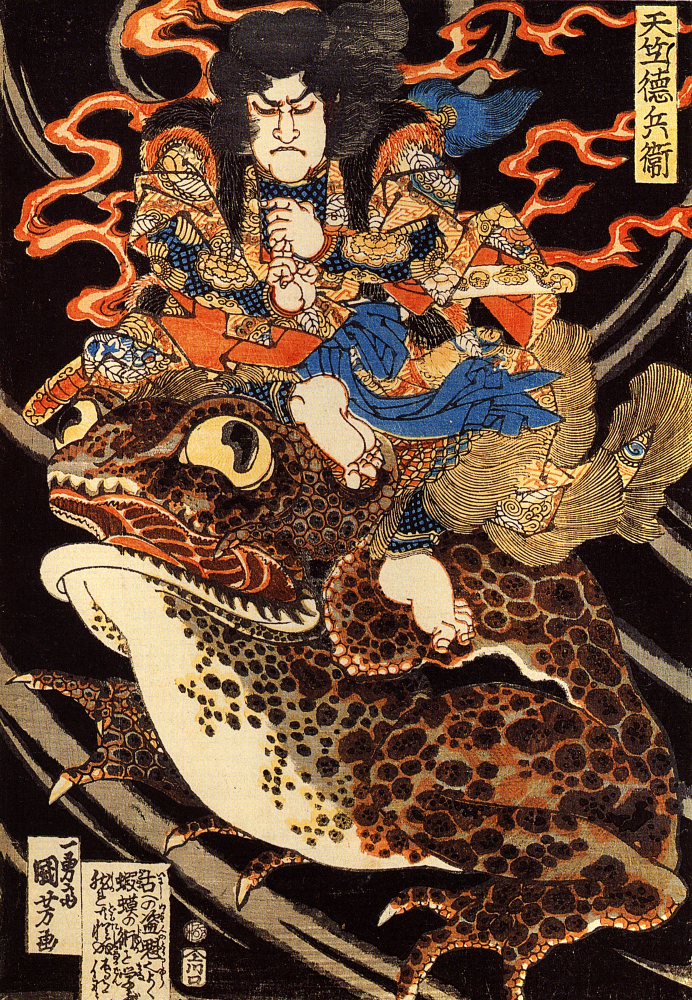

# Enhancing Art Classification: A Comparative Study of CNN, Transfer Learning, and SVM Models

## Table of Contents 📑
- [Overview](#overview-)
- [Dataset Information](#dataset-information-)
- [Technology and Language](#technology-and-language-)
- [Installation Instructions](#installation-instructions-)
- [System Requirements](#system-requirements-)
- [Usage Examples](#usage-examples-)
- [Architecture and Models](#architecture-and-models)
- [Contributing](#contributing-)
- [Contact Information](#contact-information-)
- [Results](#results-)

## Overview 🎯

This project aims to enhance the classification of art images through a comparative study of Convolutional Neural Networks (CNNs), Transfer Learning with ResNet50, and Support Vector Machine (SVM) models. The project explores different machine learning techniques and their effectiveness in classifying various art styles and genres, with a focus on understanding the unique characteristics of each approach.

<p align="center">
  
  
  
  
  <br>
  <em><span style="color:green">Some of the paintings used in the dataset. Works by Van Gogh, Matisse, Toyokuni, and Aivazovsky.</span></em>
</p>


## Dataset Information 📊

The project utilizes a dataset of paintings available on [Kaggle](https://www.kaggle.com/competitions/painter-by-numbers/data), originally sourced from [WikiArt](https://www.wikiart.org). The dataset comprises images from 2319 different artists and 43 unique painting genres.

### File Descriptions

- **train.zip**: Zip file containing the images in the training set (.jpg)
- **test.zip**: Zip file containing the images in the test set (.jpg)
- **train_info.csv**: File listing image filename, artistID, genre, style, date, and title for images in the training set.
- **all_data_info.csv**: File containing additional information such as dimensions, size in bytes, artist group, etc.

### Filtering and Thresholding

The project focuses on a subset of artists, applying a threshold of 500 paintings to include an artist in the dataset. This approach ensures balanced classes, manageable model complexity, and quality representation of the artists' styles.

The filtered dataset includes the following 12 artists, representing a variety of 30 unique painting genres:

- Ivan Aivazovsky
- Gustave Dore
- Rembrandt
- Pierre-Auguste Renoir
- Albrecht Durer
- Ivan Shishkin
- Giovanni Battista Piranesi
- John Singer Sargent
- Zdislav Beksinski
- Ilya Repin
- Pablo Picasso
- Marc Chagall

Please adhere to the terms and utilize the images only for the purposes of data mining, which constitutes a form of fair use.

<p align="center">
  
  <br>
  <em>Distribution of the Number of Paintings per Artist</em>
</p>

## Technology and Language 💻

- **Programming Language**: Python
- **Libraries**: 
  - NumPy 🧮
  - Pandas 🐼
  - Seaborn 📊
  - Matplotlib 📉
  - OpenCV 📷
  - scikit-image 🖼️
  - scikit-learn 🤖
  - Torch 🔥
  - torchvision 🎞️
- **Platforms**: Jupyter Notebook 📘

## Installation Instructions 📥

1. **Python**: Ensure that Python (version 3.6 or higher) is installed on your system.
2. **Required Libraries**: Install the required libraries with the following command:

   ```bash
   pip install numpy pandas seaborn matplotlib opencv-python-headless pillow scikit-image scikit-learn torchvision torch
   ```

3. **Jupyter Notebook**: To run the provided Jupyter Notebook, install and start Jupyter:

   ```bash
   pip install jupyter
   jupyter notebook
   ```

### How to Download and Use the Dataset 📥

1. **Visit the Dataset Page**: Go to the [Kaggle dataset page](https://www.kaggle.com/competitions/painter-by-numbers/data).
2. **Download the Files**: Click on the "Download" button (you may need to sign in or create a Kaggle account).
3. **Save the ZIP Files**: Save the downloaded ZIP files (train.zip and test.zip) to your desired directory. The code provided in the project will handle the ZIP archives directly, so there's no need to extract them manually.

### Part A: Basic Explorations & Data Loading 🧐

In the initial part of the code, you'll need to set the path to the directory where you saved the ZIP files. This will allow you to load the `all_data_info.csv` file and perform initial data exploration. Example-

```python
path = '/Users/adityaprakash/Downloads/PaintersDataset/'  # Set this to the directory where you saved train.zip, test.zip, and all_data_info.csv
df_info = pd.read_csv(path+'all_data_info.csv')
df_info.head()
```

## System Requirements 💽

### CPU Requirements

- **Processor**: Intel i5 or equivalent (Minimum), Intel i7 or equivalent (Recommended)
- **Memory**: 8GB RAM (Minimum), 16GB RAM (Recommended)

### GPU Requirements (Optional but Recommended for Faster Computation)

- **GPU**: NVIDIA GeForce GTX 1050 or equivalent (Minimum), NVIDIA GeForce GTX 1060 or higher (Recommended)
- **Memory**: 4GB VRAM (Minimum), 6GB VRAM or higher (Recommended)

## Usage Examples 🚀

Open the provided Jupyter Notebook [`Code_Jupyter.ipynb`](Code_Jupyter.ipynb) to explore the full implementation, including:

- **Data Preprocessing**: Extracting features, scaling, and splitting data.
- **Model Training**: Training CNN, SVM, and Transfer Learning models.
- **Evaluation**: Analyzing model performance.
- **Visualization**: Visualizing data and model predictions.

## Architecture and Models 🏗️

### Convolutional Neural Networks (CNN)

<p align="center">
  
  <br>
  <em>Architecture of the Convolutional Neural Network used in the project</em>
</p>

The CNN model employed in this project is built with multiple convolutional layers followed by pooling layers, fully connected layers, and a softmax activation function. It is designed to automatically and adaptively learn spatial hierarchies of features from the input images.

### Transfer Learning with ResNet50

The project also explores transfer learning using the [ResNet50](https://pytorch.org/vision/main/models/generated/torchvision.models.resnet50.html) architecture. ResNet50 is a deep residual network that has 50 layers, including convolutional and fully connected layers. By leveraging pre-trained weights from the ImageNet dataset, the ResNet50 model is fine-tuned to adapt to the specific art classification task.

For more detailed information about the ResNet50 architecture, refer to the [official PyTorch documentation](https://pytorch.org/vision/main/models/generated/torchvision.models.resnet50.html).

### Support Vector Machine (SVM)

The SVM model used in this study utilizes different kernel functions and hyperparameter tuning to classify the artworks based on extracted features. It serves as a comparison to understand the advantages and potential limitations of deep learning models for art classification.

Certainly! Here's the Results section that provides a concise summary of the outcomes from the CNN, ResNet, and SVM models. You can add this section to the existing documentation:

## Results 📈

The project experimented with different machine learning models to classify art images. Below are the summarized results for each approach:

### Convolutional Neural Networks (CNN)

The CNN model achieved a test accuracy of approximately 59.70%. The model showed progressive improvement during training and reached its best performance after 16 epochs. Here are some highlights:

- **Training Accuracy**: 69.84%
- **Validation Accuracy**: 59.69%
- **Test Loss**: 1.2615
- **Test Accuracy**: 59.70%

### Transfer Learning with ResNet50

By leveraging the ResNet50 architecture, the model achieved a significant test accuracy of approximately 72.37%. The model stopped early after 10 epochs due to no improvement in validation loss. The results are:

- **Training Accuracy**: 205.25 (custom metric)
- **Validation Accuracy**: 74.74%
- **Test Loss**: 0.9001
- **Test Accuracy**: 72.37%

### Support Vector Machine (SVM)

The SVM model, utilized as a comparative baseline, achieved a test accuracy of 55.67%. A detailed classification report shows varying performance across different classes:

- **Test Accuracy**: 55.67%
- **Precision**: Ranges from 0.37 to 0.72 across classes
- **Recall**: Ranges from 0.29 to 0.89 across classes
- **F1-Score**: Ranges from 0.33 to 0.78 across classes

The SVM results highlight the advantages and potential limitations of using classical machine learning techniques for complex art classification tasks.

These results offer valuable insights into the effectiveness of different machine learning techniques in art classification. While deep learning models like CNN and ResNet50 showed promising results, the comparative study with SVM provides a comprehensive perspective on the challenges and potentials in art classification.

## Contributing 🤝

Contributions, issues, and feature requests are welcome! Here's how you can get started:

1. **Fork the Project**: Click the 'Fork' button at the top right of this page to create your own copy of this repository.

2. **Clone Your Fork**: Clone your fork to your local machine using `git clone https://github.com/your-username/your-repo-name.git`.

3. **Create a New Branch**: Create a new branch for your feature or fix using `git checkout -b feature/YourFeatureName`.

4. **Make Your Changes**: Make and commit your changes with descriptive commit messages.

5. **Push to Your Fork**: Push your changes to your fork on GitHub using `git push origin feature/YourFeatureName`.

6. **Open a Pull Request**: Go to the 'Pull requests' tab on the original repository and click the 'New pull request' button. Select your fork and the branch you created, then click 'Create pull request'.

7. **Wait for Review**: We will review your pull request and provide feedback. Please be patient and address any comments or requested changes.

If you have any questions or need help, feel free to reach out to us or open an issue.

Thanks for contributing!

## Contact Information 📧

For inquiries or collaboration, please contact the authors:

- **Aditya Prakash**: [aditya.prakash@ucdconnect.ie](mailto:aditya.prakash@ucdconnect.ie)
- **Shreya Grover**: [shreya.grover@ucdconnect.ie](mailto:shreya.grover@ucdconnect.ie)

---

<p align="center">
  <em>Enhancing Art Classification: A Comparative Study of CNN, Transfer Learning, and SVM Models</em>
  <br>
  <em>© 2023 Aditya Prakash and Shreya Grover</em>
</p>